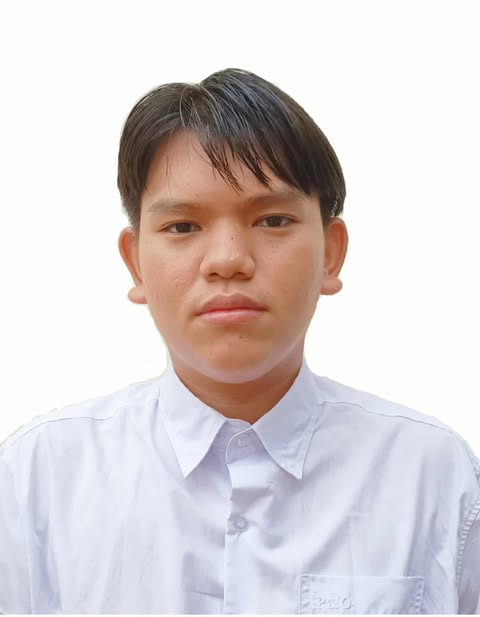

# **KHANT KYAW OO**

Undergraduate Student in International Business Management,
Payap University, Department of Business Administration

 **CONTACT**

- **Location:** Nong Pa Khrang, Mueang Chiang Mai 50000, Thailand  
- **Gmail:** [mehmkarakmon@gmail.com](mailto:mehmkarakmon@gmail.com)  
- **Phone:** +66 61 739 0975  

---

###  Objective

Dedicated International Business Management student and former DISP scholar with a strong academic background and a passion for research. Skilled in data analysis, market research, and problem-solving, with experience in academic writing and teamwork.  
Interested in contributing to research on Myanmar’s most pressing issues and regional challenges. Highly organized, detail-oriented, and committed to producing insightful and impactful research.

---

###  Education
- **Payap University, Thailand** — *B.Sc. in International Business Management (Current)*  
  *GPA: 4.0*
- **Mon National College** — *Associate Degree in Community Leadership and Management*  
  *GPA: 3.3*

---

###  Field-related Experiences
**Research on Mon Youth Migration** *(Jan – Apr 2024)*  
- Conducted a two-week research project on why Mon youth engage in migration.  
- Designed and implemented surveys and interviews to collect data.  
- Analyzed migration trends and socio-economic factors influencing youth decisions.  
- Compiled findings into a structured report with key insights and recommendations.

**Community and Educational Support Volunteer** *(Flexible dates)*  
- Assisted students in Mae Sot with mental health support, focusing on children’s well-being.  
- Taught a three-month online course (Nov 2024 – Jan 2025) providing educational guidance.  
- Provided learning materials to Mon National Schools in Ye Town, supporting students and educators.

---

###  Skills
- Research & Data Analysis  
- Project Management  
- Communication & Teamwork  
- Problem Solving  
- Leadership & Community Development  
- **Languages:** Mon, Myanmar, English

---

###  Awards & Certifications
- Volunteer Recognition Award  
- Excellent Academic Award  
- Certificate of Youth Leadership — *JCI Thailand*  
- Communication Training Class (Online)  
- Basic Computer Certification  

---

###  About Me
A dedicated scholar who loves learning and helping people. I enjoy connecting with communities, exploring business solutions, and working toward sustainable development in Myanmar and the ASEAN region.

---

### Connect With Me

- **LinkedIn:** [LinkedIn](https://www.linkedin.com/in/khant-kyaw-oo-690b16396)  
- **GitHub:** [GitHub](https://karakadoresu.github.io)  
- **Facebook:** [Facebook](https://web.facebook.com/mmehmkaraklovesu/)

